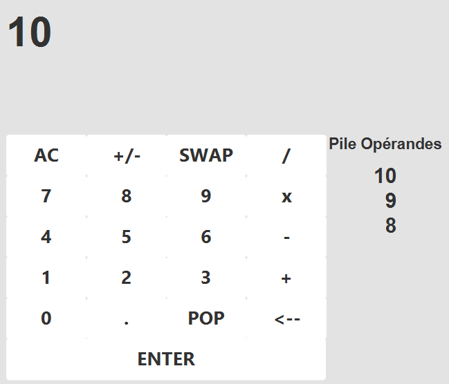

# Calculator Application README

## Overview
This Calculator Application is a Java-based program designed to perform basic arithmetic operations. It follows the MVC (Model-View-Controller) architecture, ensuring a clean separation of concerns between user interface, business logic, and data handling.

## Getting Started
To run this game, ensure you have Java and JavaFX installed on your system.

### Prerequisites
- Java JDK 8 or above
- JavaFX SDK

### Running the Game
1. Clone the repository to your local machine.
2. Navigate to the project directory.
3. Compile the Java files: `javac -cp path/to/javafx-sdk/lib --add-modules javafx.controls INSERT MODULES`.
4. Run the Main class: `java -cp path/to/javafx-sdk/lib --add-modules javafx.controls Main`

Note: Modify the paths to compile the Java Files using JavaFX SDK according to the actual location of your JavaFX SDK.

## File Structure
The project consists of the following key components:

1. **Main.java**
   - The main entry point of the application. It is responsible for initializing and launching the calculator.

2. **CalculatorGUI.java**
   - Manages the graphical user interface (GUI) of the calculator. This component presents information to the user and captures user input.

3. **CalculatorModel.java**
   - Handles the data and core logic of the calculator, such as performing calculations and storing results.

4. **CalculatorControler.java**
   - Contains the logic for controlling calculator operations. This component acts as an intermediary between the Model and GUI.

In addition to these, there are corresponding interface files (`CalculatorControlerInterface.java`, `CalculatorModelInterface.java`, `CalculatorGUIInterface.java`) that define essential methods for each component. Also, an `application.css` file is included for styling the GUI.

## Usage
To run the application:
1. Ensure you have Java installed on your system.
2. Compile the Java files.
3. Run `Main.java`.

## Interface

  

<i>RPN Calculator Interface</i>

## Contributions
This project is open for contributions. Please adhere to standard coding practices when making changes or additions.
For questions or feedback, please contact me at [arthurrubio0@gmail.com](mailto:arthurrubio0@gmail.com)!

## License
This project is licensed under the GNU General Public License v3.0 - see the [LICENSE](LICENSE) file for details.
